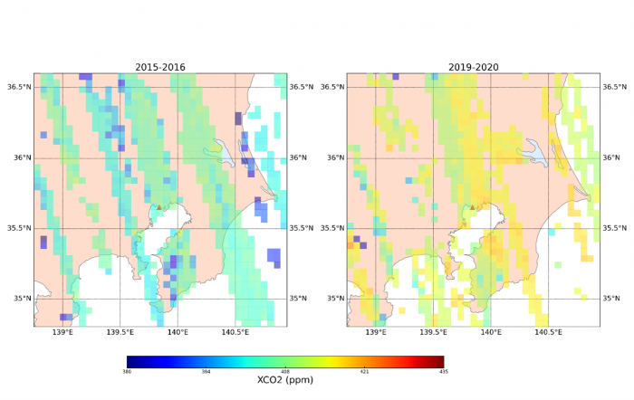

# OCO2 CO2 observation data visualization tools

This repository places the tools for eazily generating CO2 observation map with simple commands. Following the instruction I expected that you are going to be able to generate the figure below. 

- Look up at the [mission website](https://www.jpl.nasa.gov/missions/orbiting-carbon-observatory-2-oco-2) for more information regarding OCO2 mission. 

- OCO2 observations can be downloaded at [NASA earth database](https://disc.gsfc.nasa.gov/datasets/OCO2_L2_Lite_FP_10r/summary?keywords=oco-2)

- Description of the OCO2 data (which includes the meaning of all he variables) can be find in the [document provided by NASA](https://docserver.gesdisc.eosdis.nasa.gov/public/project/OCO/OCO2_OCO3_B10_DUG.pdf) 

## Envirnment setup  

1. Before setting up the envirnment, you have to ensure you have already with [conda](https://conda.io/projects/conda/en/latest/user-guide/install/index.html#installing-conda-on-a-system-that-has-other-python-installations-or-packages) installed. 
2. Run `conda env create -f environment.yml`. 
3. Run `conda activate oco2` to activate the `oco2` environment. 

## Usage

Following the instruction in `src/run.py`. 
